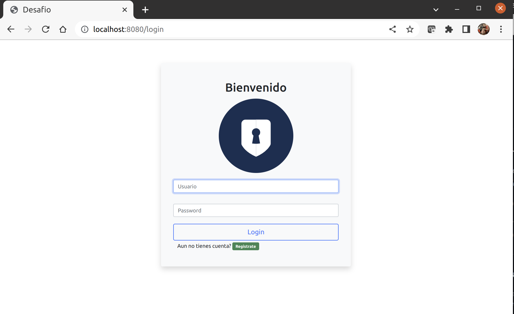
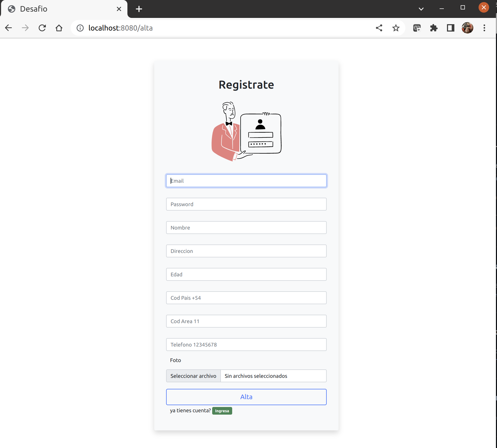
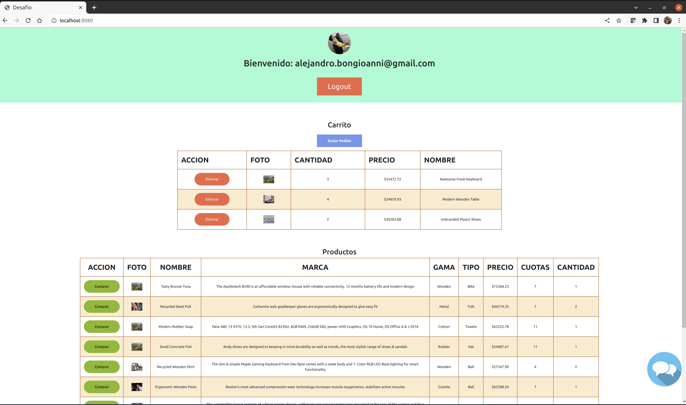

# PROYECTO CODERHOUSE BACKEND CON NodeJS

## Let's start 🚀

To set up dependencies:
### npm install

To run this app:
### npm start

Deploy Heroku

[Heroku](https://coder-desafio-app.herokuapp.com/)